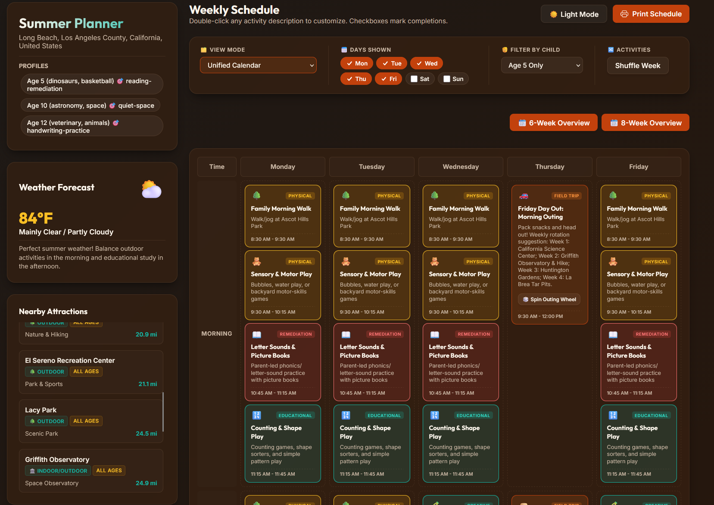
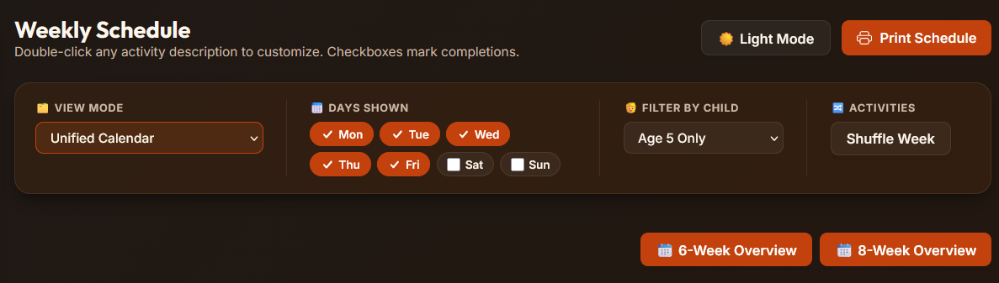

<p align="center">
  
</p>

<h1 align="center">☀️ Summer Spark</h1>
<p align="center"><strong>An AI agent skill that turns "what are the kids doing this summer?" into a real, personalized, printable plan.</strong></p>

<p align="center">
  
  
  
  
</p>

---

Tell it who's in the family, where you live, and what each kid is into. Summer Spark checks the real weather forecast, finds real nearby attractions, and builds a full Monday–Sunday schedule that actually fits — reading remediation for the kid who needs it, sensory play for the toddler, a coding block for the teen, and a pool day whenever it's too hot to be outside. It lands as one self-contained, interactive HTML file you open in a browser.

No two families get the same plan. No two days look alike. No silent reading for a 5-year-old. 🙂

## ✨ What it does

- 🧒 **Age-aware, not one-size-fits-all** — every child gets a schedule built for their actual developmental stage, from toddlers to older teens, not just a handful of hardcoded ages.
- 🌦️ **Weather-adaptive** — pulls a live forecast and reshuffles the day: pool time on scorchers, museum trips on rainy days, park time on the nice ones.
- 📍 **Real nearby attractions** — geocodes your address and ranks real local spots by actual distance (with a sensible generic fallback outside the LA area).
- 🚗 **Configurable weekly outing** — pick which day is field-trip day, and spin the "Outing Wheel" 🎲 to randomize the destination.
- 🔀 **Shuffle Week** — one click re-rolls which day gets which flexible activity, without touching weather-driven or field-trip content.
- 🌗 **Light & dark mode** — warm color themes in both, remembered across reloads.
- 🖨️ **Print-ready** — clean printable weekly calendars plus 6-week and 8-week high-level overviews.
- 📚 **Built-in worksheet & learning center** — curated links for reading, math, coding, STEM, and printable activity sheets.
- ♿ **Accessible & responsive** — keyboard focus states, ARIA labels, and a toolbar that behaves on a phone screen.
- 🛡️ **Resilient** — geocoding/weather calls retry with backoff, and failures show up as a clear on-page banner instead of silently faking data.
- ✅ **Actually tested** — 45 pytest tests, ruff + mypy clean, CI on every push.

## 📸 A peek inside

<table>
<tr>
<td width="50%" align="center"><b>🌙 Dark mode</b></td>
<td width="50%" align="center"><b>☀️ Light mode</b></td>
</tr>
<tr>
<td></td>
<td></td>
</tr>
</table>

<p align="center"><i>Same toolbar, zero clutter — view mode, days shown, per-kid filter, and Shuffle Week all in one row.</i></p>
<p align="center"></p>

<details>
<summary><b>📆 Multi-week overview (click to expand)</b></summary>
<br>

</details>

<details>
<summary><b>📚 Worksheet & learning center (click to expand)</b></summary>
<br>

</details>

## 🚀 Quickstart

```bash
python .agents/skills/summer-schedule-designer/scripts/generate_schedule.py \
    --location "El Sereno, Los Angeles, CA" \
    --field-trip-day Friday \
    --profiles-file profiles.json
```

Where `profiles.json` looks like:

```json
[
  { "age": 5,  "hobbies": ["dinosaurs", "basketball"], "needs": ["reading-remediation"] },
  { "age": 10, "hobbies": ["astronomy", "space"],       "needs": ["quiet-space"] },
  { "age": 12, "hobbies": ["veterinary", "animals"],    "needs": ["handwriting-practice"] }
]
```

That's it — open the generated `summer_schedule.html` in any browser. No server, no build step, no dependencies to install to *view* it.

> 🤖 **This is an agent skill.** It's designed to be driven by an AI agent (see [`SKILL.md`](.agents/skills/summer-schedule-designer/SKILL.md)), which interviews the parent, confirms the plan, and runs the command above for you. Running the script directly works too — it's just less conversational.

### Useful flags

| Flag | What it does |
|---|---|
| `--location` | Home city/state or full address |
| `--fallback-location` | Used automatically if `--location` fails to geocode |
| `--field-trip-day` | Day of the week for the recurring outing (default `Friday`) |
| `--profiles-file` | Path to a JSON file of child profiles (preferred — no shell-quoting pain) |
| `--profiles` | Inline JSON string, for quick one-offs |
| `--output` | Where to write the generated HTML (default `summer_schedule.html`) |

## 🧠 How it's built

```
.agents/skills/summer-schedule-designer/
├── SKILL.md              ← the agent-facing workflow (onboarding → confirm → generate → explain)
├── resources/
│   └── template.html     ← the entire interactive planner UI (single self-contained file)
└── scripts/
    ├── generate_schedule.py  ← thin CLI entry point
    ├── cli.py                ← argument parsing & validation
    ├── geocode.py             ← Nominatim geocoding with retry + structured errors
    ├── weather.py             ← Open-Meteo forecast + activity advice
    ├── schedule.py            ← age-band logic, attractions, weekly schedule builder
    ├── ui.py                  ← fills the HTML template with generated data
    ├── net.py                 ← shared retry/backoff + error helper
    └── tests/                 ← 45 pytest tests, mocked network calls
```

Every network call (geocoding, weather) retries with exponential backoff, and if it still fails, the failure is shown to the parent in the UI — never silently swapped for fake data.

## 🧪 Developing

```bash
cd .agents/skills/summer-schedule-designer/scripts
pip install -r requirements-dev.txt

pytest             # 45 tests, mocked network calls
ruff check .       # lint
mypy .             # type check
```

CI runs all three on every push via [`.github/workflows/summer-schedule-designer-ci.yml`](.github/workflows/summer-schedule-designer-ci.yml).

---

<p align="center">Made for one family, generalized for every family. 🧡</p>
